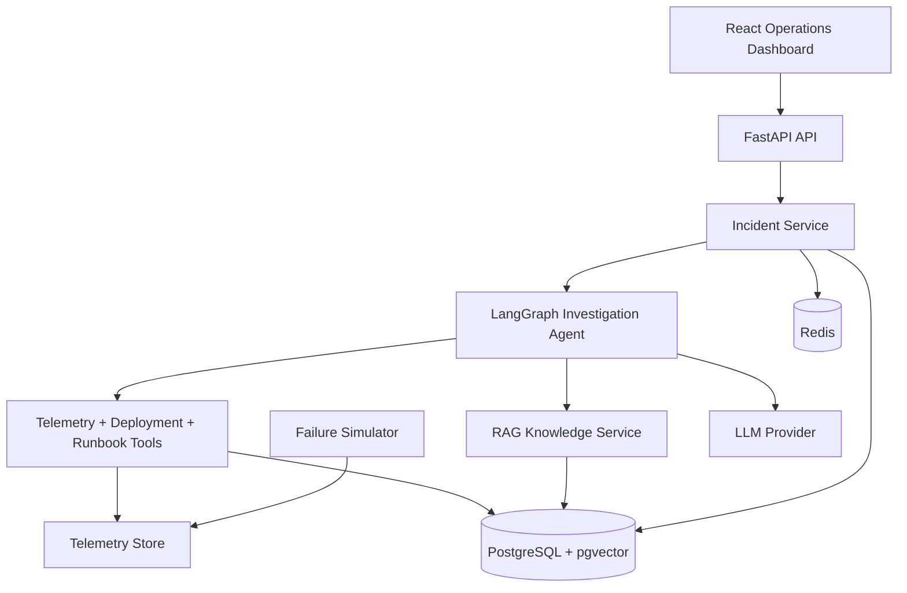

# 🛡️ Aegis

[](https://github.com/AloneRider-pixel/aegis/actions/workflows/ci.yml)
[](https://github.com/AloneRider-pixel/aegis/actions/workflows/codeql.yml)
[](LICENSE)

**AI-powered production reliability and incident-response platform.**

Aegis investigates production incidents by combining telemetry, operational knowledge, and an AI agent with controlled tool access. It builds an evidence chain, proposes remediation, and requires explicit human approval before impactful actions are executed.

> **Portfolio focus:** AI agents + RAG + backend engineering + observability + reliability engineering + human-in-the-loop safety.

## Why Aegis

Production incidents often require engineers to correlate metrics, logs, traces, deployments, runbooks, and historical incidents before forming a root-cause hypothesis. Aegis automates the investigation workflow while keeping remediation approval under human control.

```text
Failure detected
      ↓
Incident created
      ↓
AI agent investigates
      ├── metrics
      ├── logs
      ├── traces
      ├── deployments
      ├── runbooks (RAG)
      └── incident history
      ↓
Evidence-backed hypothesis
      ↓
Remediation recommendation
      ↓
Human approval
      ↓
Execution + audit trail
      ↓
Postmortem
```

## Architecture



## Engineering highlights

### AI investigation engine
- LangGraph state machine with explicit investigation phases.
- Tool access for metrics, logs, traces, deployments, runbooks, and incident history.
- Evidence-backed findings with confidence information.
- Prompt-injection defenses for untrusted operational content.
- Human approval gate before impactful remediation.

### RAG knowledge system
- Ingests runbooks, postmortems, and operational documents.
- Chunking → embedding → pgvector storage.
- Hybrid retrieval with reranking.
- Metadata filtering by service, document type, and environment.

### Reliability and safety
- Incident lifecycle with validated state transitions.
- Dry-run and execution modes for remediation.
- Risk assessment and rollback strategy.
- Audit trail for incident and remediation actions.
- JWT authentication, role-based access, rate limiting, and input validation.

### Failure simulation
Aegis includes reproducible synthetic failure scenarios so the investigation workflow can be demonstrated without touching a real production system.

Example: **database connection exhaustion after deployment**

1. Simulator increases database connection pressure.
2. Metrics show saturation while errors and latency increase.
3. Aegis creates an incident.
4. The agent correlates telemetry, deployment information, runbooks, and history.
5. The system produces a root-cause hypothesis with supporting evidence.
6. Remediation is recommended and gated by human approval.

## Evaluation integrity

The repository contains an evaluation data model and API for recording benchmark runs. The current `/api/evaluations/run` endpoint generates **synthetic demo metrics for UI/workflow validation**; those values are not presented here as a statistically valid model benchmark.

Before publishing model-performance claims, add a fixed, versioned evaluation dataset and report the evaluation methodology, dataset composition, exact-match criteria, and reproducible results.

## Technology stack

| Layer | Technology |
|---|---|
| Backend | Python 3.12, FastAPI, SQLAlchemy, Alembic |
| AI | LangGraph, configurable LLM provider |
| RAG | pgvector, sentence-transformers, hybrid retrieval |
| Database | PostgreSQL 16, Redis 7 |
| Frontend | React 18, TypeScript, Vite, TailwindCSS |
| Observability | OpenTelemetry, structured JSON logging |
| Testing | Pytest, Playwright, Locust |
| Infrastructure | Docker, Kubernetes, Terraform, GitHub Actions |
| Security | JWT, role-based authorization, CodeQL, Dependabot |

## Repository structure

```text
aegis/
├── backend/
│   ├── app/
│   │   ├── ai/                 # Agent, tools, and RAG
│   │   ├── simulator/          # Reproducible failure scenarios
│   │   ├── services/           # Business logic
│   │   ├── auth/               # Authentication and authorization
│   │   ├── models/             # Database models
│   │   └── middleware/         # Rate limiting, logging, security
│   ├── tests/                  # Unit and integration tests
│   └── alembic/                # Database migrations
├── frontend/                   # React operations dashboard
├── docs/                       # Architecture, runbooks, ADRs
├── scripts/                    # Seed/demo utilities
├── .github/workflows/          # CI/CD and CodeQL
├── docker-compose.yml
├── Makefile
└── README.md
```

## Local development

### Prerequisites

- Docker + Docker Compose
- An LLM provider key configured through `.env`

### Start

```bash
git clone https://github.com/AloneRider-pixel/aegis.git
cd aegis
cp .env.example .env
docker compose up -d

docker compose exec backend alembic upgrade head
docker compose exec backend python -m scripts.seed_knowledge
```

Services:

- Frontend: `http://localhost:3000`
- API: `http://localhost:8000`
- OpenAPI: `http://localhost:8000/docs`

### Run tests

```bash
docker compose exec backend pytest
docker compose exec backend pytest tests/unit/
docker compose exec backend pytest tests/integration/
```

## API surface

| Method | Endpoint | Purpose |
|---|---|---|
| POST | `/api/auth/login` | Authenticate |
| GET | `/api/incidents` | List incidents |
| POST | `/api/incidents/{id}/investigate` | Start AI investigation |
| POST | `/api/incidents/{id}/approve-remediation` | Approve remediation |
| POST | `/api/knowledge/search` | Search operational knowledge |
| POST | `/api/evaluations/run` | Create synthetic evaluation run data |

Interactive OpenAPI documentation is available at `/docs`.

## Demo incident

Trigger the reproducible database-connection-exhaustion scenario:

```bash
curl -X POST http://localhost:8000/api/simulator/scenarios/db-connection-exhaustion/trigger \
  -H "Authorization: Bearer <token>"

curl http://localhost:8000/api/incidents?status=investigating \
  -H "Authorization: Bearer <token>"
```

## CI and security

The CI pipeline validates backend quality/tests, frontend builds, and Docker images. CodeQL analyzes Python and JavaScript/TypeScript on pushes, pull requests, and a scheduled run.

Runtime secrets are provided through environment variables and are not intended to be committed to source control.

## Roadmap

- Fixed, versioned benchmark dataset for reproducible agent evaluation.
- Persistent investigation history and asynchronous job execution.
- Broader telemetry adapters and production integrations.
- OpenTelemetry metrics and model-cost telemetry.
- Regression suite with adversarial prompt-injection fixtures.

## License

MIT
