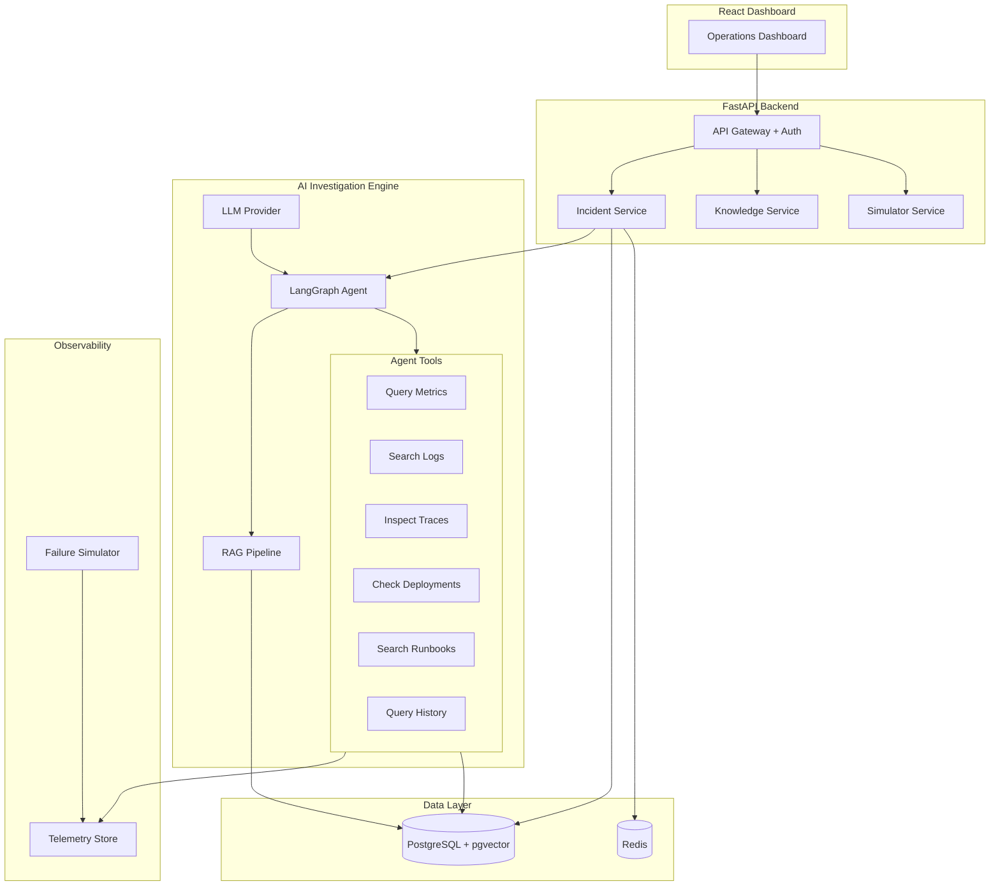

# 🛡️ Aegis

**AI-Powered Production Reliability & Incident Response Platform**

Aegis monitors applications, detects anomalies, automatically investigates incidents using an AI agent with tool access, retrieves relevant runbooks via RAG, identifies root causes with evidence-backed reasoning, and recommends remediation — requiring human approval before executing any impactful action.

---

## Problem

When production systems fail, engineers face a painful cycle:
1. Alert fires → scramble to understand what broke
2. Check 5+ dashboards, grep through logs, trace through services
3. Search runbooks (if they exist), ask colleagues
4. Form hypothesis → test → iterate
5. Finally fix → write postmortem (often skipped)

This takes 30-120+ minutes per incident. The same patterns repeat. Knowledge lives in people's heads.

## Solution

Aegis automates the investigation phase:

```
Failure Detected → AI Agent Investigates → Root Cause Identified → 
Remediation Recommended → Human Approved → Fix Executed → Postmortem Generated
```

The AI agent queries metrics, logs, traces, deployments, and runbooks — building an evidence chain. It never executes without human approval. Every investigation is auditable.

## Architecture



## Demo Scenario

**"Database Connection Exhaustion After Deployment"**

1. Deployment simulation increases DB connections
2. Metrics detect connection saturation (95% → 100%)
3. Error rate spikes from 0.1% → 15%
4. Aegis auto-creates SEV-2 incident
5. AI agent investigates:
   - Queries metrics: DB connections at 100%, error rate 15%
   - Searches logs: "connection pool exhausted" errors
   - Checks deployments: checkout-service deployed 5 min ago
   - Searches runbooks: finds "DB Connection Exhaustion" guide
   - Checks history: 3 similar incidents, all deployment-related
6. AI determines: **"Checkout-service deployment v2.4.0 introduced connection leak"** (confidence: 0.92)
7. Recommends: Rollback to v2.3.9
8. Human approves → Rollback executes → System recovers → Postmortem generated

## Technology Stack

| Layer | Technology |
|-------|-----------|
| Backend | Python 3.12, FastAPI, SQLAlchemy, Alembic |
| AI Agent | LangGraph, LLM abstraction (OpenAI/Gemini/Local) |
| RAG | pgvector, sentence-transformers, hybrid retrieval |
| Database | PostgreSQL 16, Redis 7 |
| Frontend | React 18, TypeScript, Vite, TailwindCSS |
| Observability | OpenTelemetry, structured JSON logging |
| Testing | Pytest, Playwright, Locust |
| Infrastructure | Docker, Kubernetes, Terraform, GitHub Actions |

## Features

### Incident Lifecycle
- 10-state incident state machine with validated transitions
- Automatic severity calculation (SEV-1 through SEV-4)
- Full audit trail of every state change

### AI Investigation Agent
- LangGraph state machine with explicit investigation phases
- 6+ real tools: metrics, logs, traces, deployments, runbooks, history
- Evidence-backed reasoning with confidence scores
- Hallucination controls: citations required, evidence grounding
- Prompt injection defense for untrusted log/document content

### RAG Knowledge System
- Document ingestion pipeline (runbooks, postmortems, docs)
- Chunking → Embedding → pgvector storage
- Hybrid retrieval (semantic + keyword) with reranking
- Metadata filtering by service, type, environment

### Failure Simulation
- 12+ realistic failure scenarios
- Generates real telemetry (metrics, logs, traces)
- Isolated from host system
- Powers both demo and evaluation

### Remediation Engine
- Dry-run mode (default) and execution mode
- Human approval required for all impactful actions
- Risk assessment and rollback strategy
- Full audit trail

### Evaluation Framework
- 100-scenario benchmark dataset
- Measures: root-cause accuracy, grounding, hallucination rate, latency, cost
- Automated scoring with human-readable reports

### Security
- JWT authentication with 4 roles (Viewer, Engineer, Incident Manager, Admin)
- Prompt injection protection
- Tool authorization per role
- Remediation approval workflow
- Rate limiting, input validation, audit logging

## Local Setup

```bash
# Clone
git clone https://github.com/AloneRider-pixel/aegis.git
cd aegis

# Configure
cp .env.example .env
# Edit .env with your OPENAI_API_KEY

# Start everything
docker compose up -d

# Run database migrations
docker compose exec backend alembic upgrade head

# Seed knowledge base
docker compose exec backend python -m scripts.seed_knowledge

# Access
# Frontend: http://localhost:3000
# API: http://localhost:8000
# API Docs: http://localhost:8000/docs
```

## Run Tests

```bash
# All tests
docker compose exec backend pytest

# Unit tests only
docker compose exec backend pytest tests/unit/

# Integration tests
docker compose exec backend pytest tests/integration/

# AI evaluation
docker compose exec backend python -m scripts.run_evaluation
```

## Run Demo Incident

```bash
# Trigger the demo scenario
curl -X POST http://localhost:8000/api/simulator/scenarios/db-connection-exhaustion/trigger \
  -H "Authorization: Bearer <token>"

# Watch investigation progress
curl http://localhost:8000/api/incidents?status=investigating \
  -H "Authorization: Bearer <token>"
```

## API Documentation

Interactive docs at `http://localhost:8000/docs` (Swagger UI)

Key endpoints:
- `POST /api/auth/login` — Authenticate
- `GET /api/incidents` — List incidents
- `POST /api/incidents/{id}/investigate` — Start AI investigation
- `POST /api/incidents/{id}/approve-remediation` — Approve remediation
- `POST /api/knowledge/search` — Search runbooks
- `POST /api/evaluations/run` — Run evaluation benchmark

## Project Structure

```
aegis/
├── backend/
│   ├── app/
│   │   ├── main.py              # FastAPI application
│   │   ├── config.py            # Settings
│   │   ├── database.py          # DB connection
│   │   ├── models/              # SQLAlchemy models
│   │   ├── schemas/             # Pydantic schemas
│   │   ├── api/                 # Route handlers
│   │   ├── services/            # Business logic
│   │   ├── ai/                  # AI agent + tools + RAG
│   │   ├── simulator/           # Failure simulation
│   │   ├── auth/                # Authentication
│   │   └── middleware/          # Rate limiting, logging
│   ├── tests/                   # Test suite
│   ├── alembic/                 # Database migrations
│   └── Dockerfile
├── frontend/
│   ├── src/
│   │   ├── components/          # React components
│   │   ├── pages/               # Dashboard pages
│   │   ├── services/            # API client
│   │   └── hooks/               # Custom hooks
│   └── Dockerfile
├── infrastructure/
│   ├── kubernetes/              # K8s manifests
│   ├── helm/                    # Helm charts
│   └── terraform/               # AWS IaC
├── scripts/                     # Utility scripts
├── docs/
│   ├── architecture/            # System docs
│   ├── runbooks/                # Operational runbooks
│   └── adr/                     # Architecture decisions
├── docker-compose.yml
└── .github/workflows/           # CI/CD
```

## License

MIT
