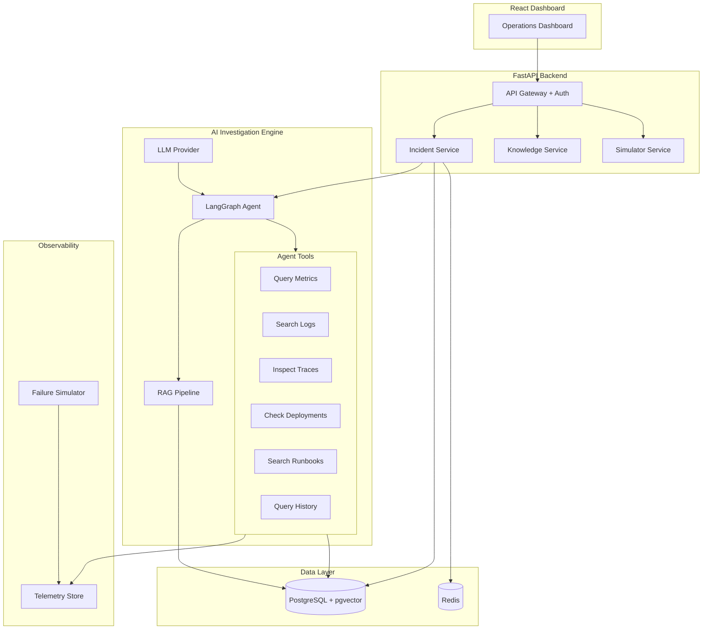

# 🛡️ Aegis

**AI-Powered Production Reliability & Incident Response Platform**

Aegis monitors applications, detects anomalies, investigates incidents using an AI agent with tool access, retrieves relevant runbooks via RAG, identifies root causes with evidence-backed reasoning, and recommends remediation — requiring human approval before executing any impactful action.

---

## Problem

When production systems fail, engineers face a painful cycle:
1. Alert fires → scramble to understand what broke
2. Check 5+ dashboards, grep through logs, trace through services
3. Search runbooks (if they exist), ask colleagues
4. Form hypothesis → test → iterate
5. Finally fix → write postmortem (often skipped)

This can take tens of minutes or longer per incident, and the same diagnostic patterns repeat.

## Solution

Aegis automates the investigation phase:

```text
Failure Detected → AI Agent Investigates → Root Cause Identified →
Remediation Recommended → Human Approved → Fix Executed → Postmortem Generated
```

The AI agent can query metrics, logs, traces, deployments, and runbooks while building an evidence chain. Impactful remediation is gated behind human approval, and investigations are auditable.

## Architecture



## Demo Scenario

**"Database Connection Exhaustion After Deployment"**

1. Deployment simulation increases DB connections
2. Metrics detect connection saturation
3. Error rate and latency rise
4. Aegis creates an incident
5. The AI agent investigates metrics, logs, deployments, runbooks, and history
6. It produces a root-cause hypothesis with supporting evidence
7. It recommends a remediation
8. A human approves the action before execution

The simulator provides reproducible synthetic telemetry for demos and development.

## Technology Stack

| Layer | Technology |
|-------|-----------|
| Backend | Python 3.12, FastAPI, SQLAlchemy, Alembic |
| AI Agent | LangGraph, LLM abstraction (OpenAI/Gemini/Local) |
| RAG | pgvector, sentence-transformers, hybrid retrieval |
| Database | PostgreSQL 16, Redis 7 |
| Frontend | React 18, TypeScript, Vite, TailwindCSS |
| Observability | OpenTelemetry, structured JSON logging |
| Testing | Pytest, Playwright, Locust |
| Infrastructure | Docker, Kubernetes, Terraform, GitHub Actions |

## Features

### Incident Lifecycle
- 10-state incident state machine with validated transitions
- Severity calculation (SEV-1 through SEV-4)
- Audit trail of state changes

### AI Investigation Agent
- LangGraph state machine with explicit investigation phases
- Agent tools for metrics, logs, traces, deployments, runbooks, and history
- Evidence-backed reasoning and confidence scores
- Hallucination controls and prompt-injection defenses for untrusted content

### RAG Knowledge System
- Document ingestion pipeline for runbooks, postmortems, and operational docs
- Chunking → embedding → pgvector storage
- Hybrid retrieval with reranking
- Metadata filtering by service, type, and environment

### Failure Simulation
- 12 predefined failure scenarios
- Generates synthetic metrics, logs, and traces
- Isolated from the host system
- Useful for demos and repeatable development tests

### Remediation Engine
- Dry-run mode and execution mode
- Human approval required for impactful actions
- Risk assessment and rollback strategy
- Audit trail

### Evaluation Framework
- Evaluation data model and API for recording benchmark runs
- Tracks root-cause accuracy, evidence grounding, hallucination rate, latency, cost, and token usage
- The current `/api/evaluations/run` endpoint generates **synthetic demo metrics** for UI/workflow validation; it is not presented as a statistically valid model benchmark
- A fixed, versioned evaluation dataset should be added before publishing benchmark claims

### Security
- JWT authentication with role-based access
- Prompt-injection protection
- Tool authorization per role
- Remediation approval workflow
- Rate limiting, input validation, audit logging
- Explicit CORS configuration via environment variable

## Local Setup

```bash
git clone https://github.com/AloneRider-pixel/aegis.git
cd aegis

cp .env.example .env
# Add provider keys and required auth/database settings

docker compose up -d
docker compose exec backend alembic upgrade head

docker compose exec backend python -m scripts.seed_knowledge
```

Access:

- Frontend: `http://localhost:3000`
- API: `http://localhost:8000`
- API docs: `http://localhost:8000/docs`

## Run Tests

```bash
docker compose exec backend pytest

docker compose exec backend pytest tests/unit/
docker compose exec backend pytest tests/integration/
```

## Run Demo Incident

```bash
curl -X POST http://localhost:8000/api/simulator/scenarios/db-connection-exhaustion/trigger \
  -H "Authorization: Bearer <token>"

curl http://localhost:8000/api/incidents?status=investigating \
  -H "Authorization: Bearer <token>"
```

## API Documentation

Interactive docs are available at `http://localhost:8000/docs`.

Key endpoints include:
- `POST /api/auth/login` — Authenticate
- `GET /api/incidents` — List incidents
- `POST /api/incidents/{id}/investigate` — Start AI investigation
- `POST /api/incidents/{id}/approve-remediation` — Approve remediation
- `POST /api/knowledge/search` — Search runbooks
- `POST /api/evaluations/run` — Create a synthetic evaluation run record for demo/workflow validation

## Project Structure

```text
aegis/
├── backend/
│   ├── app/
│   │   ├── main.py              # FastAPI application
│   │   ├── config.py             # Settings
│   │   ├── database.py           # DB connection
│   │   ├── models/               # SQLAlchemy models
│   │   ├── schemas/              # Pydantic schemas
│   │   ├── services/             # Business logic
│   │   ├── ai/                   # AI agent + tools + RAG
│   │   ├── simulator/            # Failure simulation
│   │   ├── auth/                 # Authentication
│   │   └── middleware/           # Rate limiting, logging
│   ├── tests/                    # Test suite
│   ├── alembic/                  # Database migrations
│   └── Dockerfile
├── frontend/
│   ├── src/
│   │   ├── components/           # React components
│   │   ├── pages/                # Dashboard pages
│   │   ├── services/             # API client
│   │   └── hooks/                # Custom hooks
│   └── Dockerfile
├── scripts/                      # Utility scripts
├── docs/                         # Architecture, runbooks, ADRs
├── docker-compose.yml
└── .github/workflows/            # CI, CodeQL, dependency automation
```

## Engineering Notes

- CI validates backend tests/coverage, frontend builds, and Docker image builds.
- CodeQL and Dependabot provide automated security/dependency checks.
- Runtime secrets are supplied through environment variables rather than source-controlled passwords.
- Development/demo credentials should be provided through `.env` or shell environment variables.

## License

MIT
