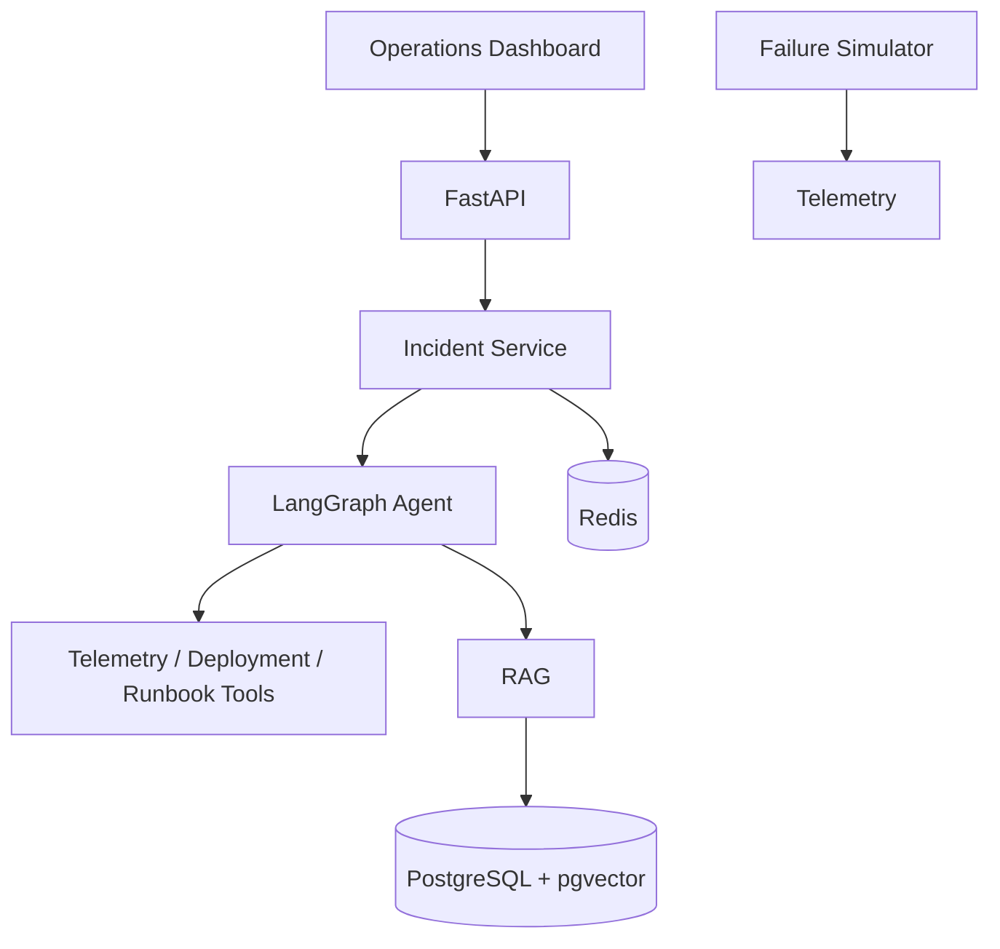

# Aegis — AI Production Reliability & Incident Response

[](https://github.com/AloneRider-pixel/aegis/actions/workflows/ci.yml)
[](https://github.com/AloneRider-pixel/aegis/actions/workflows/codeql.yml)
[](LICENSE)

A production-oriented incident-response reference platform that combines telemetry, operational knowledge, RAG, and bounded AI investigation while keeping impactful remediation behind explicit human approval.

## Why Aegis

Incident response systems have two failure modes: they can be too manual to scale, or too autonomous to trust. Aegis separates investigation from execution so AI can collect and reason over evidence without silently turning model output into an operational side effect.

## Operating model

```text
Telemetry
   ↓
Incident
   ↓
Evidence-backed investigation
   ↓
Remediation recommendation
   ↓
Human approval
   ↓
Execution + audit trail
```

## Engineering capabilities

- LangGraph investigation workflows with bounded tool execution.
- Metrics, logs, traces, deployment, runbook, and incident-history context.
- Hybrid RAG with pgvector and metadata filters.
- Prompt-injection defenses for untrusted operational content.
- Explicit incident state transitions and audit logging.
- Reproducible failure simulation.
- JWT/RBAC, rate limiting, CodeQL, dependency review, and Scorecard.
- React/Vite operations dashboard with explicit loading and error states.

## Architecture


```mermaid
graph TB
    UI[Operations Dashboard] --> API[FastAPI]
    API --> INC[Incident Service]
    INC --> AGENT[LangGraph Agent]
    AGENT --> TOOLS[Telemetry / Deployment / Runbook Tools]
    AGENT --> RAG[RAG]
    RAG --> PG[(PostgreSQL + pgvector)]
    INC --> REDIS[(Redis)]
    SIM[Failure Simulator] --> TEL[Telemetry]
```

## Stack

| Layer | Technology |
|---|---|
| Backend | Python 3.12, FastAPI, SQLAlchemy, Alembic |
| AI | LangGraph, configurable LLM provider |
| Retrieval | pgvector, sentence-transformers |
| Data | PostgreSQL 16, Redis 7 |
| Frontend | React, Vite, Tailwind CSS |
| Observability | OpenTelemetry, structured logging |
| Testing | Pytest, Playwright, Locust |
| Delivery | Docker, Kubernetes, Terraform, GitHub Actions |

## Quick start

Prerequisites: Docker Compose.

```bash
git clone https://github.com/AloneRider-pixel/aegis.git
cd aegis
cp .env.example .env
docker compose up -d
docker compose exec backend alembic upgrade head
```

Local endpoints:

- API: `http://localhost:8000`
- Frontend: `http://localhost:3000`

## Verification

```bash
docker compose exec backend pytest
docker compose exec backend pytest tests/unit/
docker compose exec backend pytest tests/integration/
cd frontend
pnpm install --frozen-lockfile
pnpm build
```

CI also validates CodeQL, dependency review, Scorecard, and the repository's Docker build path.

## Security model

Treat incident telemetry, logs, runbooks, retrieved text, user input, and model output as untrusted. Investigation is allowed to inspect these inputs; impactful remediation remains separately authorized, observable, and auditable.

Do not place credentials in the repository or expose server-side secrets through the frontend.

## Evaluation integrity

The repository contains deterministic and synthetic fixtures for engineering validation. Those fixtures are not production model benchmarks. Any public quality, reliability, latency, or accuracy claim should identify its dataset/workload, methodology, environment, sample count, and producing commit.

## Documentation

- [Architecture](docs/architecture.md)
- [System architecture](docs/architecture/system.md)
- [Verification](docs/verification.md)
- [Evidence policy](docs/evidence-policy.md)
- [Security](SECURITY.md)

## Contribution standard

Keep changes small and reviewable, preserve fail-closed validation, add regression coverage for behavioral fixes, and keep documentation aligned with the implemented control flow.

## Roadmap

Versioned evaluation datasets, asynchronous investigations, broader telemetry adapters, cost telemetry, and stronger adversarial regression coverage.

## License

MIT
