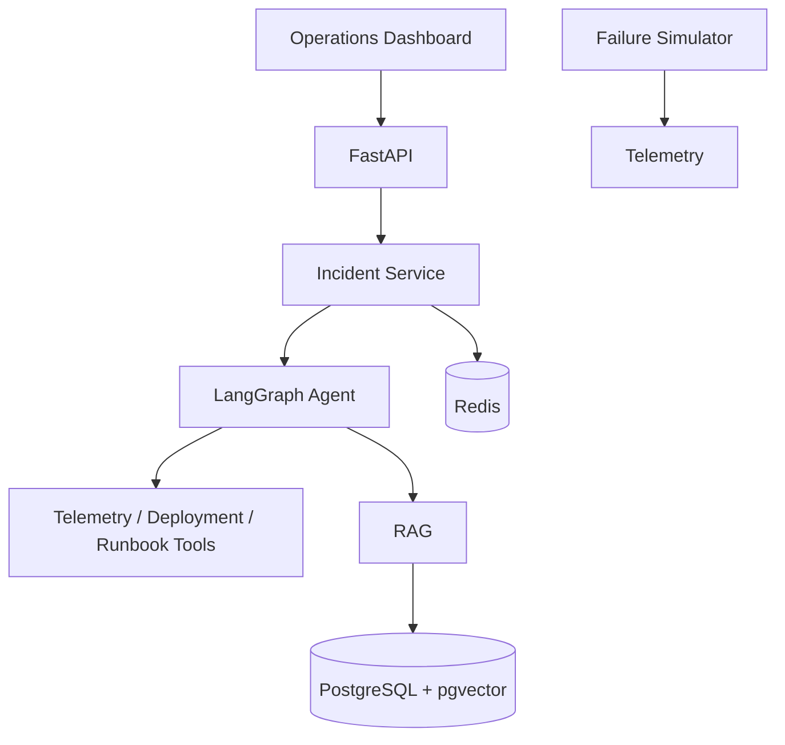

# Aegis — AI Production Reliability & Incident Response

[](https://github.com/AloneRider-pixel/aegis/actions/workflows/ci.yml)
[](https://github.com/AloneRider-pixel/aegis/actions/workflows/codeql.yml)
[](LICENSE)

AI-assisted incident-response reference platform that correlates telemetry, operational knowledge, and controlled remediation while keeping execution authority behind explicit approval.

## Core operating model

```text
Telemetry
   ↓
Incident
   ↓
Evidence-backed investigation
   ↓
Remediation recommendation
   ↓
Human approval
   ↓
Execution + audit trail
```

## Engineering capabilities

- LangGraph investigation workflows.
- Metrics, logs, traces, deployment, runbook, and incident-history tools.
- Hybrid RAG with pgvector and metadata filters.
- Prompt-injection defenses for untrusted operational content.
- Validated incident state transitions and audit logging.
- Reproducible failure simulation.
- JWT/RBAC, rate limiting, CodeQL, dependency review, CI/CD.
- React/Vite operations dashboard.

## Architecture


```mermaid
graph TB
    UI[Operations Dashboard] --> API[FastAPI]
    API --> INC[Incident Service]
    INC --> AGENT[LangGraph Agent]
    AGENT --> TOOLS[Telemetry / Deployment / Runbook Tools]
    AGENT --> RAG[RAG]
    RAG --> PG[(PostgreSQL + pgvector)]
    INC --> REDIS[(Redis)]
    SIM[Failure Simulator] --> TEL[Telemetry]
```

## Stack

| Layer | Technology |
|---|---|
| Backend | Python 3.12, FastAPI, SQLAlchemy, Alembic |
| AI | LangGraph, configurable LLM provider |
| RAG | pgvector, sentence-transformers |
| Data | PostgreSQL 16, Redis 7 |
| Frontend | React, TypeScript, Vite, Tailwind CSS |
| Observability | OpenTelemetry, structured logging |
| Testing | Pytest, Playwright, Locust |
| Delivery | Docker, Kubernetes, Terraform, GitHub Actions |

## Quick start

```bash
git clone https://github.com/AloneRider-pixel/aegis.git
cd aegis
cp .env.example .env
docker compose up -d
docker compose exec backend alembic upgrade head
```

API: `http://localhost:8000`  
Frontend: `http://localhost:3000`

## Verification

```bash
docker compose exec backend pytest
docker compose exec backend pytest tests/unit/
docker compose exec backend pytest tests/integration/
cd frontend
pnpm install --frozen-lockfile
pnpm build
```

CI validates the backend/frontend quality surface together with CodeQL, dependency review, and Scorecard.

## Safety model

Incident telemetry, logs, runbooks, and model output are untrusted inputs. Investigation may inspect them, but impactful remediation must remain separately authorized and auditable.

## Evaluation integrity

The current evaluation endpoint generates synthetic demo values for workflow/UI validation. Those values are not production model benchmarks. Any public quality result should include a fixed dataset, methodology, environment, sample count, and producing commit.

## Documentation

- [Architecture](docs/architecture.md)
- [System architecture](docs/architecture/system.md)
- [Verification](docs/verification.md)
- [Evidence policy](docs/evidence-policy.md)
- [Security](SECURITY.md)

## Roadmap

Versioned evaluation datasets, asynchronous investigations, broader telemetry adapters, cost telemetry, and stronger adversarial regression coverage.

## License

MIT
