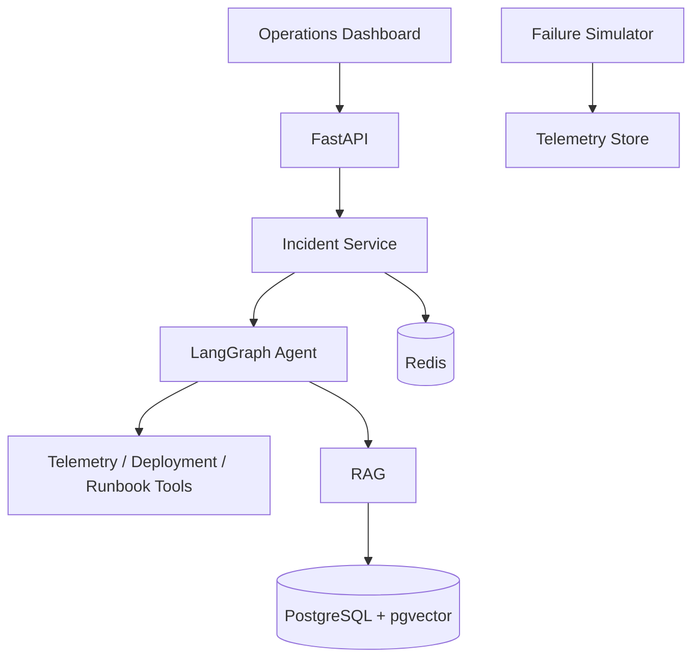

# 🛡️ Aegis

[](https://github.com/AloneRider-pixel/aegis/actions/workflows/ci.yml)
[](https://github.com/AloneRider-pixel/aegis/actions/workflows/codeql.yml)
[](LICENSE)

AI-powered production-reliability and incident-response platform that correlates telemetry, operational knowledge, and controlled remediation workflows.

## Core principle

```text
Telemetry
   ↓
Incident
   ↓
Evidence-backed AI investigation
   ↓
Remediation recommendation
   ↓
Explicit human approval
   ↓
Execution + audit trail
```

The investigation system can inspect telemetry, deployments, runbooks, and incident history, but impactful remediation remains approval-gated.

## Engineering highlights

- LangGraph investigation state machine.
- Metrics, logs, traces, deployment, runbook, and incident-history tools.
- Hybrid RAG with pgvector and metadata filters.
- Prompt-injection defenses for untrusted operational content.
- Validated incident state transitions and audit logging.
- Reproducible synthetic failure simulator.
- JWT/RBAC, rate limiting, CodeQL, dependency review, and CI/CD.

## Architecture


```mermaid
graph TB
    UI[Operations Dashboard] --> API[FastAPI]
    API --> INC[Incident Service]
    INC --> AGENT[LangGraph Agent]
    AGENT --> TOOLS[Telemetry / Deployment / Runbook Tools]
    AGENT --> RAG[RAG]
    RAG --> PG[(PostgreSQL + pgvector)]
    INC --> REDIS[(Redis)]
    SIM[Failure Simulator] --> TEL[Telemetry Store]
```

## Evaluation integrity

The current evaluation endpoint generates synthetic demo metrics for workflow/UI validation. Those values are not presented as statistically valid model benchmarks. Publish model-quality results only with a fixed dataset, explicit methodology, and reproducible artifacts.

## Stack

| Layer | Technology |
|---|---|
| Backend | Python 3.12, FastAPI, SQLAlchemy, Alembic |
| AI | LangGraph, configurable LLM provider |
| RAG | pgvector, sentence-transformers |
| Data | PostgreSQL 16, Redis 7 |
| Frontend | React, TypeScript, Vite, TailwindCSS |
| Observability | OpenTelemetry, structured logging |
| Testing | Pytest, Playwright, Locust |
| Delivery | Docker, Kubernetes, Terraform, GitHub Actions |

## Quick start

```bash
git clone https://github.com/AloneRider-pixel/aegis.git
cd aegis
cp .env.example .env
docker compose up -d
docker compose exec backend alembic upgrade head
```

API: `http://localhost:8000`  
Frontend: `http://localhost:3000`

## Verification

```bash
docker compose exec backend pytest
docker compose exec backend pytest tests/unit/
docker compose exec backend pytest tests/integration/
cd frontend
pnpm install --frozen-lockfile
pnpm build
```

## Demo scenario

The failure simulator includes a reproducible database-connection-exhaustion scenario designed for safe investigation demos without touching a real production system.

## Security

Keep LLM credentials and infrastructure credentials outside source control. Treat telemetry, runbooks, logs, and model output as untrusted data. Keep remediation tool access explicitly authorized and auditable.

## Review path

Start with [architecture](docs/architecture.md), [verification](docs/verification.md), and the backend authorization/remediation tests before changing tool permissions.

## Evidence policy

Measured claims should identify dataset/workload, methodology, environment, sample size, and producing commit. See [Evidence Policy](docs/evidence-policy.md) where applicable.

## Roadmap

- Fixed, versioned evaluation dataset.
- Async investigation jobs and persistent history.
- Broader telemetry adapters.
- Model-cost telemetry and stronger adversarial regression coverage.

## Maintenance standard

Never conflate investigation evidence with execution authority. Any permission expansion requires corresponding authorization and audit coverage.

## License

MIT
