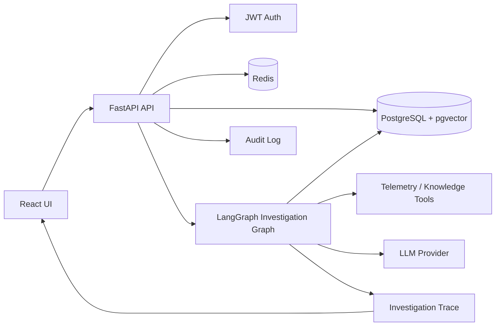

# Aegis Architecture

## Control flow

1. Authenticate the operator.
2. Create or inspect an incident.
3. Run the investigation graph to collect evidence and evaluate hypotheses.
4. Persist root-cause analysis, evidence, and investigation trace.
5. Gate remediation behind explicit approval.
6. Execute only an approved remediation, with dry-run as the default safety mode.

## Reliability boundaries

- PostgreSQL is the durable system of record.
- Redis supports transient state and rate-limiting concerns.
- AI outputs are treated as recommendations backed by evidence rather than autonomous authority.
- Auditability is maintained through incident events and investigation traces.
