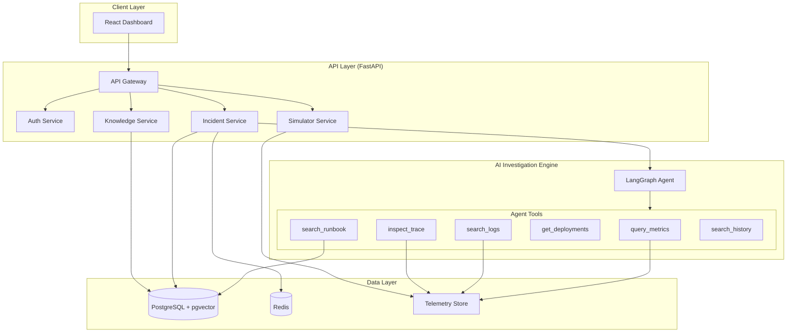

# System Architecture

## Overview

Aegis is an AI-powered incident response platform that automates the investigation and remediation of production incidents. The system uses a LangGraph-based agent with tool access to query metrics, logs, traces, deployments, and runbooks to identify root causes.

## Component Architecture

## Key Decisions

### Why LangGraph over single-prompt LLM?
- Explicit state transitions allow auditing and debugging
- Each phase can be tested independently
- Tool calls are structured and validated
- Supports bounded iteration (safety)
- Enables partial investigation recovery

### Why pgvector over separate vector DB?
- Single database reduces operational complexity
- Transactions span application data + vectors
- PostgreSQL is battle-tested for production
- Sufficient performance for our scale (<1M chunks)

### Why simulator instead of real failures?
- Safe, repeatable, deterministic
- No risk to real infrastructure
- Powers both demo and evaluation
- Can run in CI/CD

## Security Model

- JWT authentication with role-based access
- 4 roles: Viewer, Engineer, Incident Manager, Admin
- Only Incident Manager+ can approve remediation
- All remediation defaults to DRY_RUN
- Prompt injection defense in agent
- Tool calls are authorized per role

## Data Flow

1. Incident detected (manual or auto)
2. AI agent invoked via LangGraph
3. Agent collects evidence via tools
4. Agent searches knowledge base (RAG)
5. Agent forms and validates hypotheses
6. Agent recommends remediation
7. Human reviews and approves
8. Remediation executes (simulated)
9. System verifies recovery
10. Postmortem generated
